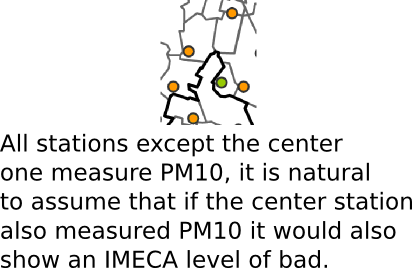
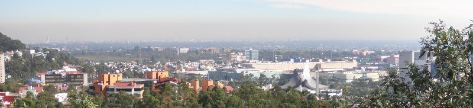

```{r, include=FALSE}
# Don't delete this chunk if you are using the mosaic package
# This loads the mosaic and dplyr packages
require(mosaic)
```

```{r, include=FALSE}
# Some customization.  You can alter or delete as desired (if you know what you are doing).

# knitr settings to control how R chunks work.
require(knitr)
opts_chunk$set(
  tidy=FALSE,     # display code as typed
  size="small"    # slightly smaller font for code
)
```

## What does it do?

This package downloads pollution data for the Mexico City metro area. It can download real-time, daily maximum, minimum, or hourly average data for each of the pollution (and wind and temperature) measuring stations or geographical zones in the Zona Metropolitana del Valle de México.


## Installation

For the moment this package is only available from github. For the development version:

```r
if (!require(devtools)) {
    install.packages("devtools")
}
devtools::install_github('diegovalle/aire.zmvm')
```

## Quick Example

The package consists mainly of three functions: 

* ```get_station_data``` downloads data for each of the pollution (and wind and temperature) measuring stations in the original measuring units.
* ```get_zone_data``` downloads data for each of the 5 geographic zones of Mexico City as measured in [IMECAs](https://en.wikipedia.org/wiki/%C3%8Dndice_Metropolitano_de_la_Calidad_del_Aire) 
* ```get_latest_data``` downloads the latest and highest pollution value in IMECAs for each of the pollution measuring stations.

```{r, fig.show='hold',  message=FALSE}
library("aire.zmvm")
library("dplyr")
library("ggplot2")
library("mgcv")
library("lubridate")
library("stringr")
library("gridExtra")
library("zoo")

# Download Ozone pollution data for all stations
o3 <- get_station_data(criterion = "MAXIMOS", # Can be one of MAXIMOS (daily maximum), 
                                                # MINIMOS (daily minimum), 
                                                # or HORARIOS (hourly average)
                       pollutant = "O3", # Can be one of "SO2", "CO", "NOX", "NO2", "NO", "O3", 
                                         # "PM10", "PM25", "WSP", "WDR", "TMP", "RH"
                       year = 2005:2017) # A numeric vector, the earliest year allowed is 1986

# Daily max among all base stations
o3_max <- o3 %>% 
  group_by(date) %>% 
  summarise(max = ifelse(all(is.na(value)),
                         NA,
                         base::max(value, na.rm = TRUE))) %>%
  na.omit()

# Plot the daily highest pm10 level with trendline
ggplot(o3_max, 
       aes(date, max, group = 1)) +
  geom_point(color = "black", size = .2, alpha = .4) +
  geom_smooth(method = "gam", formula = y ~ s(x)) +
  labs(title = "Daily maximum O3 levels",
       subtitle = "On July 2015 the supreme court overturned a rule banning all cars more than eight years old from the\n'hoy no circula' program") +
  ylab("maximum daily O3 value in ppb") +
  xlab("date") +
  geom_vline(xintercept = as.numeric(as.Date("2015-07-01"))) +
  annotate("text", label = "supreme court ruling", 
           x = as.Date("2014-01-20"),
           y = 350) +
  theme_bw()
```

## Station data

The function ```get_station_data``` can be used to download pollution and wind data going back to 1986, altough not all pollutants are available that far back, and requesting a pollutant that is
not available will result in a warning.

```{r get-data, cache=TRUE}
download_data <- function(pollutant) {
  print(paste0("Downloading data for: ", pollutant))
  suppressWarnings({
    o3 <- get_station_data(criterion = "MAXIMOS", # Can be MAXIMOS (daily maximum), 
                           # MINIMOS (daily minimum), 
                           # or HORARIOS (hourly average)
                           pollutant = pollutant, # "SO2", "CO", "NOX", "NO2", "NO", "O3", 
                           # "PM10", "PM25", "WSP", "WDR", "TMP", "RH"
                           year = 1986:2016) # The earliest year allowed is 1986
  })  
  o3$pollutant <- pollutant
  # Daily max among all base stations
  o3 %>% 
    group_by(date, pollutant) %>% 
    summarise(max = ifelse(all(is.na(value)),
                           NA,
                           base::max(value, na.rm = TRUE))) %>%
    na.omit()
}

ll <- mapply(download_data, 
             pollutant = c("NO", "SO2", "CO", "NOX", "NO2", "O3", "PM10", "PM25"),
             SIMPLIFY = FALSE)
df_maximos <- bind_rows(ll)
knitr::kable(head(df_maximos))
```


We can plot all pollutants going back to 1986 and add a trend line based on a GAM controlling for month of year, with lines for the start of the hoy no circula and the supreme court decision that the hoy no circula doesn't necessarily apply to older cars. A more complex model is left as an execise to the reader.


```{r smallmult, fig.width=9, fig.height=20}
fitted <- function(max, month, date, year) {
  df=data.frame(max = max,
                month = month,
                date = date,
                year = year)
  fit <- gam(max ~ s(month, bs = "cc", k = 12) + s(as.numeric(date), k = 20),
         data = df, correlation = corARMA(form = ~ 1|year, p = 1))
  predict(fit, newdata = df, type = "terms")[,2] + mean(max)
}

df_maximos <- df_maximos %>%
  mutate(month = month(date),
         year = year(date))%>%
  group_by(pollutant) %>%
  mutate(pred =fitted(max,month,date,year))


# Plot the daily highest level with trendline
ggplot(df_maximos, 
       aes(date, max, group = 1)) +
  geom_point(color = "black", size = .2, alpha = .05) +
  geom_line(aes(date, pred), color ="blue", size = 1.2)  +
  labs(title = "Daily maximum pollutant levels",
       subtitle = "On November 1989 the 'hoy no circula' program was implemented in Mexico City. On July 2015 the supreme court overturned\na rule banning all cars more than eight years old from the 'hoy no circula' program") +
  ylab("maximum daily value") +
  xlab("date") +
  geom_vline(xintercept = as.numeric(as.Date("1989-11-20"))) +
  geom_vline(xintercept = as.numeric(as.Date("2015-07-01"))) +
  theme_bw() +
  facet_wrap(~pollutant, scales = "free_y", ncol = 1)


```

## Zone data

For analyzing the effect of pollution, Mexico City was divided into four zones. The function ```get_zone_data``` can download data for each zone as measured in IMECAs as opposed to the original units that ```get_station_data``` uses. Note that the statndards for measuring PM10 and O3 in IMECAS changed in October 2014 and the function prints a warning.

```{r, fig.show='hold',  message=FALSE}

# Download pm10 data since 2008 for all available zones ("TZ")
pm_10 <- get_zone_data(criterion = "MAXIMOS", # Can be MAXIMOS (daily maximum) or 
                                              # HORARIOS (hourly average)
                       pollutant = "PM10", # "SO2", "CO", "NO2", "O3", "PM10", 
                                           # "TC" (All pollutants)
                       zone = "TZ", # "NO", "NE", "CE", "SO", "SE", "TZ" (All zones)
                       start_date = "2010-01-01", # Can't be earlier than 2008-01-01
                       end_date = "2017-01-15") # Can be up to the current date
knitr::kable(head(pm_10))
```


Plotting the data makes the change that took place in October 2014 really obvious:

```{r}

# Plot the overall highest maximum pm10 level with trendline
pm10_imecas_plot <- ggplot(pm_10 %>% group_by(date) %>% summarise(max = max(value, na.rm = TRUE)), 
                      aes(date, max, group = 1)) +
  geom_line(color = "darkgray", size = .2) +
  geom_smooth(method = "gam", formula = y ~ s(x, k = 50), se = FALSE) +
  ggtitle("Daily maximum PM10 levels in IMECAS") +
  geom_vline(xintercept = as.numeric(as.Date("2014-10-28"))) +
  theme_bw()

pm10_u <- get_station_data("MAXIMOS", "PM10", 2010:2016)
pm10_u_plot <- ggplot(pm10_u %>% group_by(date) %>% summarise(max = max(value, na.rm = TRUE)), 
                aes(date, max, group = 1)) +
  #geom_line(color = "darkgray", size = .2) +
  geom_smooth(method = "gam", formula = y ~ s(x, k = 50), se = FALSE) +
  ggtitle("Daily maximum PM10 levels in µg/m³") +
  geom_vline(xintercept = as.numeric(as.Date("2014-10-28"))) +
  theme_bw()

grid.arrange(pm10_imecas_plot, pm10_u_plot, ncol = 1)
```

## Pollutant levels, by hour

Here's an example of plotting the maximum pollution value for Ozone and PM10 by hour of day.

```{r hours-horarios, cache=TRUE}

download_horarios <- function(pollutant) {
  print(paste0("Downloading data for: ", pollutant))
  o3 <- get_station_data(criterion = "HORARIOS", # Can be MAXIMOS (daily maximum), 
                         # MINIMOS (daily minimum), 
                         # or HORARIOS (hourly average)
                         pollutant = pollutant, # "SO2", "CO", "NOX", "NO2", "NO", "O3", 
                         # "PM10", "PM25", "WSP", "WDR", "TMP", "RH"
                         year = 2001:2016) # The earliest year allowed is 1986
  o3$pollutant <- pollutant
  # Daily max among all base stations
  o3 %>% 
    group_by(date, hour, pollutant) %>% 
    summarise(max = ifelse(all(is.na(value)),
                           NA,
                           base::max(value, na.rm = TRUE))) %>%
    na.omit()
}

ll_horarios <- mapply(download_horarios, 
             pollutant = c("O3", "PM10"),
             SIMPLIFY = FALSE)
df_horarios <- bind_rows(ll_horarios)
```

### Dealing with daylight savings time

The data returned by ```get_station_data``` when the "HORARIOS" criterion is used includes the date and hour of each measurement. The hour is specified as an offset from midnight and does not 
include daylight savings time (basically GMT+6).

```{r}
knitr::kable(head(df_horarios))
# The time is given in hours with no DST
# GMT has no DST
df_horarios$datetime <- strptime(str_c(df_horarios$date, " ", df_horarios$hour),
         "%Y-%m-%d %H", tz = "GMT+6") %>% as.POSIXct()
# Convert to MXC time
df_horarios$datetime <- as.POSIXct(format(df_horarios$datetime, 
                                          tz="America/Mexico_City",
                                          usetz = TRUE))
df_horarios$hour_dst <- hour(df_horarios$datetime)
```

Ozone peaks a couple of hours after midday and PM10 particles peak with communiting hours, and sometimes around midnight because of fireworks and trash burning. A phase I 
contingency is declared when the __24 hour__ average PM10 concentration exceeds 150 IMECAS in at least two stations and for O3 when the
hourly average exceeds 150 IMECAS (the data is shown in the original units of the data, not IMECAS)

```{r}
df_horarios$hour_dst <- factor(df_horarios$hour_dst, 
                               levels = c(5:23, 0:4), 
                               ordered = TRUE)

ggplot(df_horarios, 
       aes(hour_dst, max, group = date, color = pollutant)) +
  geom_line(alpha = I(1/sqrt((2016-2001)*365))) +
  facet_wrap(~pollutant) +
  coord_cartesian(ylim = c(0, 380)) +
  guides(color = guide_legend("pollutant",
                               override.aes = list(alpha = 1))) +
  theme_bw() +
  xlab("hour of day") +
  ylab("maximum pollution value among all stations") +
  scale_x_discrete(breaks = seq(0, 23, 5)) +
  labs(title = "Peak hours for O3 and PM10 pollutants",
       subtitle = "Each line represents one day")

```


## Real-time data

We can use the function ```get_latest_data``` to download real-time data of the pollutant with the highest value at each station. But be warned that some stations are missing sensors for some pollutants.

```{r  warning=FALSE }


library("ggmap")
library("viridis")
library("gstat")
library("sp")


```

```{r}
mxc <- get_latest_data()
print(mxc$datetime[[1]])
```

The package also sincludes a data.frame with the location of all stations

```{r message=FALSE}
data("stations")
knitr::kable(head(stations))
qmplot(lon, lat, data = stations, maptype = "toner-background")
```


### Map of stations

but only a subset of stations are functioning at any given time (and some are no longer in service)

```{r warning=FALSE }
mxc <- na.omit(left_join(mxc, stations, by = "station_code"))
qmplot(lon, lat, data = mxc, maptype = "toner-background", zoom = 11) +
  geom_point(aes(color = value), size = 8) +
  scale_color_viridis()

```


One problem with the plot is that not all stations measure all pollutants (some are missing PM10 sensors and so on). In the picture below all the stations marked orange have PM10 sensors, but the one marked green doesn't, it is incorrect to think that just because it is missing a sensor there is no PM10 pollution.






We can improve on the dot plot of the data by creating a grid of Mexico City and using inverse
distace weigthing to color each cell with the maximum pollution value extrapolated from all stations.

```{r}
geography.o3 <- mxc[,c("lat", "lon", "value")]
coordinates(geography.o3) <- ~lon+lat
#spplot(geography.o3)

pixels = 100
geography.grd <- expand.grid(x=seq((min(coordinates(geography.o3)[,1])-.1),
                          (max(coordinates(geography.o3)[,1])+.1),
                          length.out=pixels),
                        y=seq((min(coordinates(geography.o3)[,2])-.1),
                          (max(coordinates(geography.o3)[,2])+.1),
                          length.out=pixels))

geography.pts <- SpatialPixels(SpatialPoints((geography.grd)))
geography.pts <- as(geography.pts, "SpatialGrid")
```

Here's what the grid looks like:

```{r}
plot(geography.pts, cex = 1.5, col = "grey")
points(geography.o3, pch = 1, col = "red", cex = 1)

# For radiation pollution the exponent should be 2
# See http://www.sciencedirect.com/science/article/pii/S009830041200372X
geography.idw <- idw(value ~ 1, geography.o3, geography.pts, idp = 2)
```


### Converting to IMECAs

What we want is to somehow extrapolate the values for each of the pollutants at each cell in the grid and display the one with the maximum value. As I mentioned, the function ```get_latest_data``` only returns the maximum pollutant data for each station, so instead we need to download data for all the pollutants using the function ```get_latest_month```, which returns data in the original measurements (ug/m^3, ppb), and covert them to IMECA (Índice Metropolitano de la Calidad del Aire) a dimensionless scale where all the pollutants can be compared.

I ran into some problems when converting to IMECA since the formulas suplied don't always match the values provided by the SEDEMA, but in general they come quite close:

```{r}
df_max_zone <- get_zone_data("MAXIMOS", c("O3"), c("TZ"),
              "2015-01-01", "2015-12-31")
df_max_station <- get_station_data("MAXIMOS", "O3", 2015)


zone_max <- df_max_zone %>%
  group_by(date) %>%
  summarise(max = max(value, na.rm = TRUE))
station_max <- df_max_station %>%
  group_by(date) %>%
  summarise(max = max(value, na.rm = TRUE)) %>%
  mutate(max_imeca = suppressWarnings(convert_to_imeca(max, "O3")))

ggplot(data.frame(station_max$max_imeca, zone_max$max), 
       aes(zone_max.max, station_max.max_imeca)) +
  geom_point(alpha = .2) +
  labs(title = "Converting Ozone ppb to IMECA") +
  ylab("IMECA from formula") +
  xlab("IMECA from SEDEMA")


df_pm10_stations <- get_station_data("HORARIOS", "PM10", 2016) %>% 
  group_by(station_code) %>%
  mutate(rollave = rollapply(value, 24,
                             function(x) {
                               if(sum(is.na(x)) > 6)
                                 return(NA)
                               mean(x, na.rm = TRUE)},
                             fill = NA, align = "right")) %>%
    mutate(value = suppressWarnings(convert_to_imeca(rollave, "PM10"))) %>%
  ungroup() %>%
  group_by(date) %>%
  summarise(max = max(value, na.rm = TRUE)) 

df_max_zone <- get_zone_data("MAXIMOS", c("PM10"), c("TZ"),
              "2016-01-01", "2016-12-31")


zone_max <- df_max_zone %>%
  group_by(date) %>%
  summarise(max = max(value, na.rm = TRUE))

ggplot(data.frame(df_pm10_stations$max, zone_max$max), 
       aes(zone_max.max, df_pm10_stations.max)) +
  geom_point(alpha = .2) +
  labs(title = "Converting PM10 µg/m³ to IMECA") +
  ylab("IMECA from formula") +
  xlab("IMECA from SEDEMA")


```

now we create a heatmap for each pollutant and plot the maximum value in each cell

```{r}
# PM10, SO2 require a 24 average, CO an 8 hour ma, others are just the latest value
get_data_roll <- function(pollutant, mxc, ave) {
  df <- get_station_single_month(pollutant, 2017, "05") %>% 
    group_by(station_code) %>%
    mutate(rollave = rollapply(value, ave,
                               function(x) {
                                 if(sum(is.na(x)) > ave / 4)
                                   return(NA)
                                 mean(x, na.rm = TRUE)},
                               fill = NA, align = "right")) %>%
    mutate(value = suppressWarnings(convert_to_imeca(rollave, pollutant))) %>%
    filter(row_number() == n())
  df
}

get_grid <- function(df) {
  df <- left_join(df, stations, by = "station_code")
  df <- df[!is.na(df$value),]
  geog <- df[,c("lat", "lon", "value")]
  coordinates(geog) <- ~lon+lat
  
  pixels = 100
  geog.grd <- expand.grid(x=seq((min(coordinates(geog)[,1])-.1),
                                (max(coordinates(geog)[,1])+.1),
                                length.out=pixels),
                          y=seq((min(coordinates(geog)[,2])-.1),
                                (max(coordinates(geog)[,2])+.1),
                                length.out=pixels))
  
  grd.pts <- SpatialPixels(SpatialPoints((geog.grd)))
  as(grd.pts, "SpatialGrid")
}

heatmap <- function(df, grid){
  if(nrow(df) == 0){
    return(data.frame(var1.pred = NA, var1.var = NA, lon = NA, lat = NA))
  }
  
  df <- left_join(df, stations, by = "station_code")
  df <- df[!is.na(df$value),]
  df <- df[,c("lat", "lon", "value")]
  coordinates(df) <- ~lon+lat
  df.idw <- idw(value ~ 1, df, grid, idp = 2, debug.level = 0)
  
  idw = as.data.frame(df.idw)
  names(idw) <- c("var1.pred", "var1.var", "lon", "lat")

  idw
}

grid <- get_grid(get_latest_data())
pm10 <- heatmap(get_data_roll("PM10", mxc, 24), grid)
o3 <- heatmap(get_data_roll("O3", mxc, 1), grid)
co <- heatmap(get_data_roll("CO", mxc, 8), grid)
no2 <- heatmap(get_data_roll("NO2", mxc, 1), grid)
so2 <- heatmap(get_data_roll("SO2", mxc, 24), grid)

idw <- pm10
idw$var1.pred <- pmax(pm10$var1.pred, 
                      o3$var1.pred,
                      co$var1.pred,
                      no2$var1.pred,
                      so2$var1.pred, na.rm = TRUE)
```


```{r, warning=FALSE}


qmplot(x, y, data = geography.grd, geom = "blank", 
       maptype = "roadmap", source = "google", zoom = 10)  +
  geom_tile(data = idw, aes(x = lon, y = lat, fill = var1.pred), alpha = .8) + 
  scale_fill_viridis("IMECAS", limits = c(0,200), option = "magma") +
  geom_point(data = left_join(get_latest_data(), stations, by = "station_code"), 
             aes(x = lon, y = lat), shape = 21, 
             color = "black", size = 2, alpha = 1) +
  #scale_color_viridis("IMECAS", discrite = TRUE, limits = c(0,200), option = "magma") +
  #scale_color_manual(breaks = c("BUENA", "REGULAR", "MALA", "MUY MALA",
  #                              "EXTREMADAMENTE MALA"),
  #                   values = viridis(5, option = "magma")) +
  ggtitle("Pollution in Mexico City")
```

```{r, echo=FALSE}
# 
# toJSON(idw, dataframe = "values")
# 
# 
# 
# 
# 
# library(caTools)
# last_24 <- c(79, 39,41,39,44,63,112,122,107,61,69,68,37,89,79,72,92,84,46,37,23,22,27,36,43)
# length(last_24)
# convert_imeca("PM10", mean(last_24))
# 
# 
# pm10_stations <- get_station_data("HORARIOS", "PM10", 2016)
# pm10_stations$contaminant <- "PM10"
# o3_stations <- get_station_data("HORARIOS", "O3", 2016)
# o3_stations$contaminant <- "O3"
# 
# pm10_stations <- pm10_stations %>%
#   group_by(station_code) %>%
#   do(mutate(., imeca = convert_imeca("PM10", runmean(value, 24, align = "right")))) %>%
#   as.data.frame()
# 
# o3_stations <- o3_stations %>%
#   group_by(station_code) %>%
#   do(mutate(., imeca = convert_imeca("O3",
#                                value))) %>%
#   as.data.frame()
# 
# pollution <- do.call(rbind, list(o3_stations,
#                     pm10_stations))
#                     #pm2_stations,
#                     #so2_stations,
#                     #no2_stations,
#                     #co_stations))
# 
# max_date <- max(pollution$date)
# max_hour <- max(pollution[pollution$date == max_date,]$hour)
# phase_i <- dplyr::filter(pollution, date == max_date & hour == max_hour) %>%
#   full_join(stations, by = "station_code") %>%
#   na.omit() %>%
#   group_by(station_code) %>%
#   summarise(max_imeca = max(imeca, na.rm = TRUE),
#             lat = lat[1],
#             lon = lon[1],
#             value = value[which(imeca == max(imeca, na.rm = TRUE))][1],
#             contaminant = contaminant[which(imeca == max(imeca, na.rm = TRUE))][1]) %>%
#   as.data.frame()
# 
# 
# 
# tail(filter(pm10_stations, station_code == "VIF"), 25)
# pm10_to_imeca_2014(mean(tail(filter(pm10_stations, station_code == "VIF"), 24)$value, na.rm=T))
# runmean(tail(filter(pm10_stations, station_code == "VIF"), 24)$value, 24, align = "right")
# tail(runmean(filter(pm10_stations, station_code == "VIF")$value, 24, align = "right"))
# pm10_to_imeca_2014(98.2)
# 
# v = tail(filter(pm10_stations, station_code == "CUT"), 90)$value
# ma <- function(x,n=24){stats::filter(x,rep(1/n,n), sides=2)}
# ma(v)
# colMeans(matrix(v, nrow=24), na.rm = TRUE)
# 
# 
# 
# 
# o3_to_imeca(15) == 11
# o3_to_imeca(17) == 12
# 
# so2_to_imeca(195) == 150
# no2_to_imeca(23) == 11
# pm10_to_imeca_2014(26) == 29
# pm10_to_imeca_2014(50)
# last_24 <- c(67,58,49,49,31,138,81,89,93,83,73,83,85,97,105,101,125,107,74,40,28,15,24,35,49)
# length(last_24)
# 
# m <- mean((o3_stations %>%
#   filter(station_code == "ATI") %>%
#   do(tail(., n=24)))$value,
#   na.rm = TRUE)
# 
# convert_imeca("PM10", mean(last_24))
```